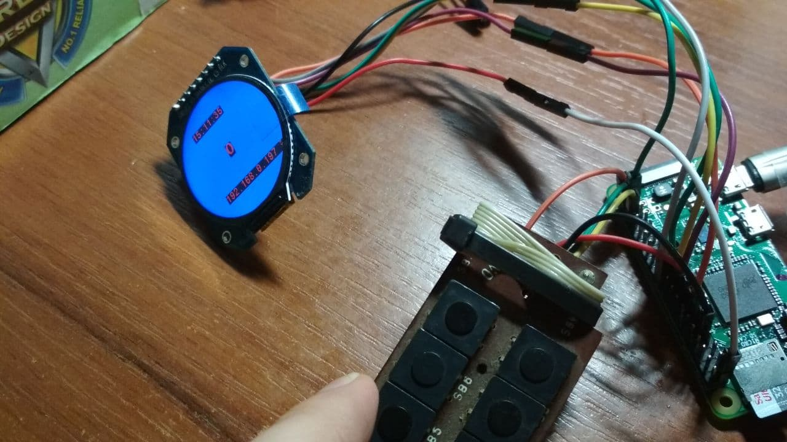
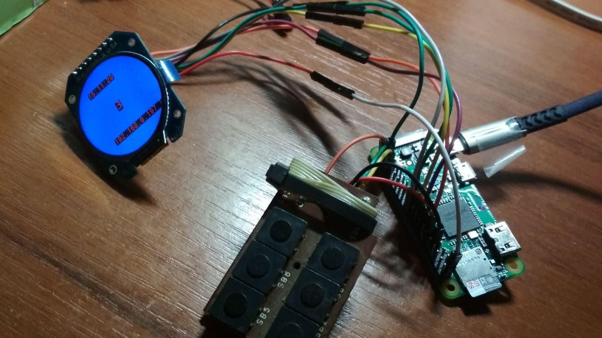
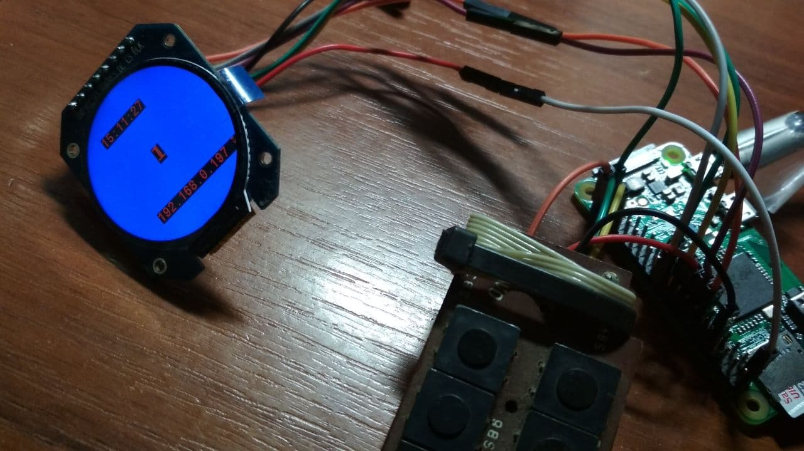
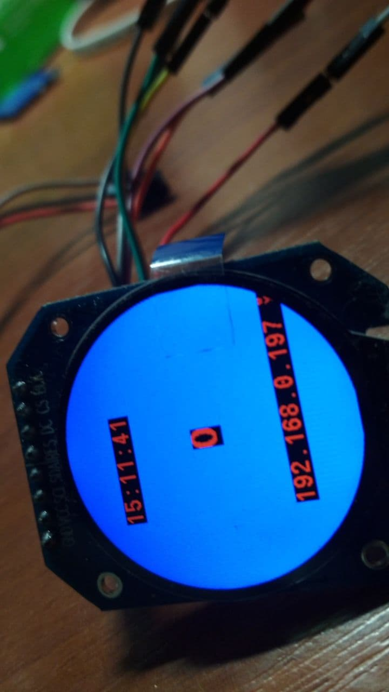
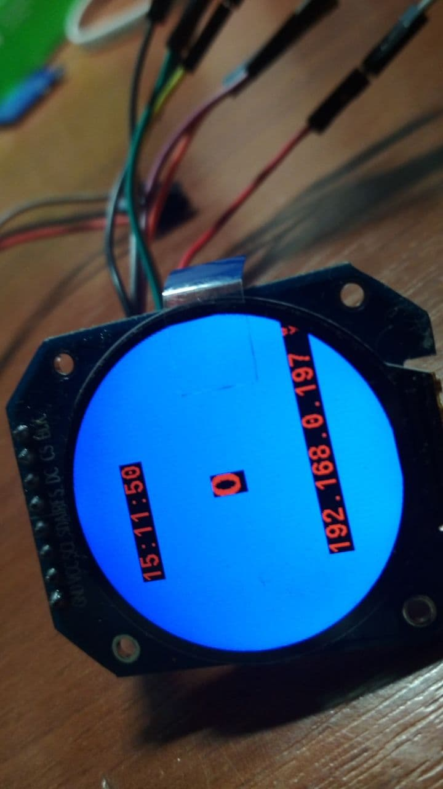
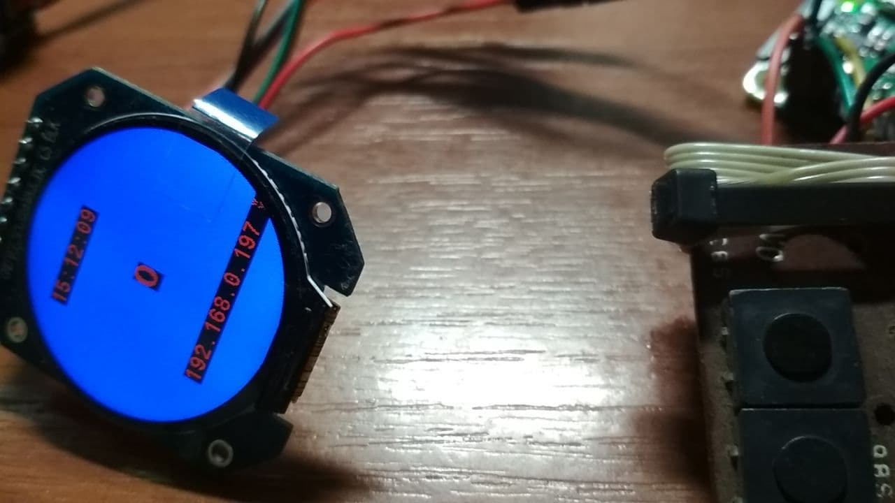
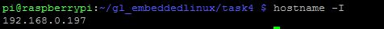

# Author
Valentyn Korniienko
# Description

[Task #4](https://gl-khpi.gitlab.io/task04/).
Отображение данных на LCD дисплее.

# Demo
## Счетчик
1. Экран до нажатия кнопок:

2. Экран после **трехкратного** нажатия кнопки **X1**:

3. Экран после **двухкратного** нажатия кнопки **X3**:

4. Экран после **краткого** нажатия кнопки **X2**:

## Время
1. Текущее время на экране:

2. Время через **9** секунд:

## IP адрес
1. IP адрес на экране:

2. Реальный IP адрес в консоли:

